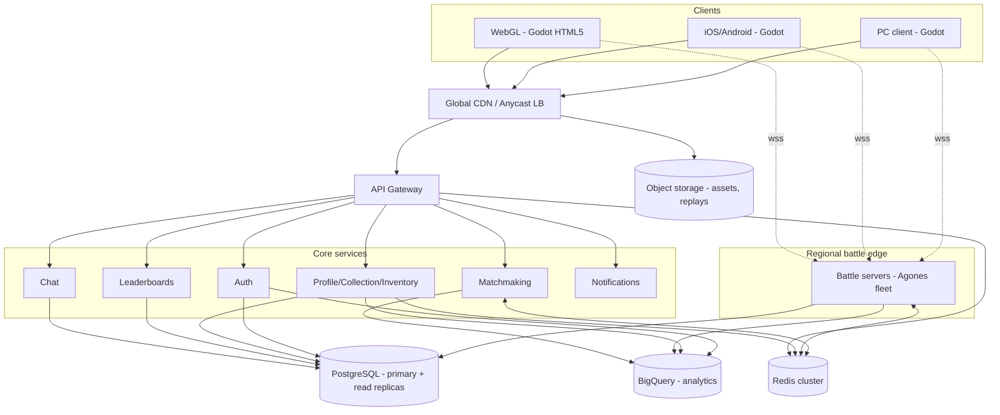
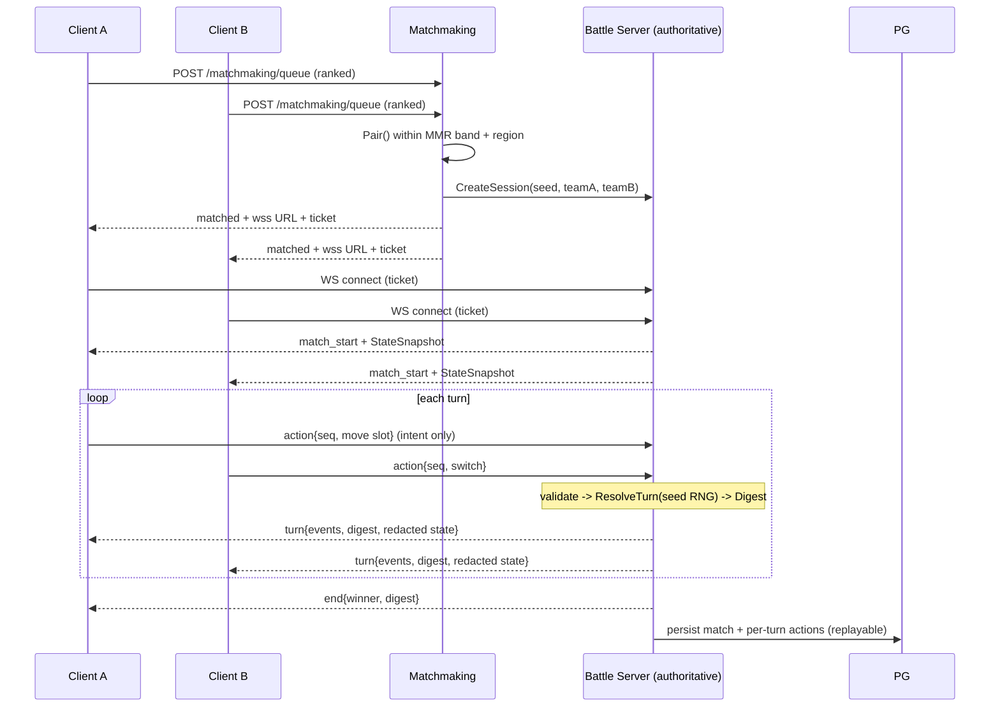
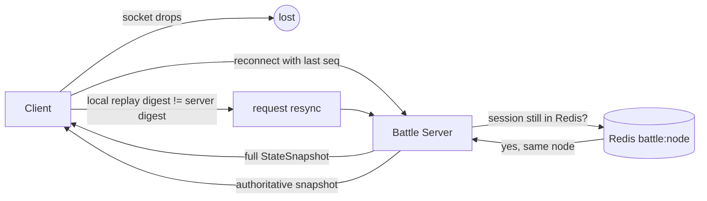
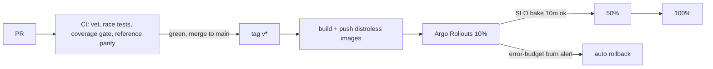
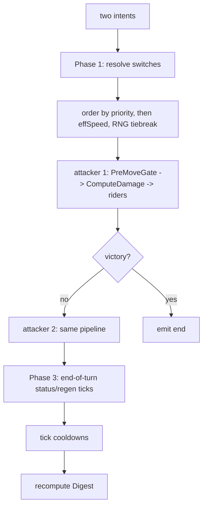

# Architecture diagrams

Rendered with Mermaid (GitHub renders these natively).

## 1. System context (C4 level 1)

## 2. Real-time PvP battle sequence (server-authoritative)

## 3. Reconnection / desync correction

## 4. CI/CD + canary

## 5. Battle engine internal flow (one turn)

